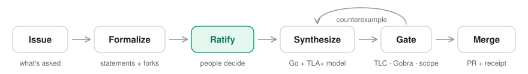
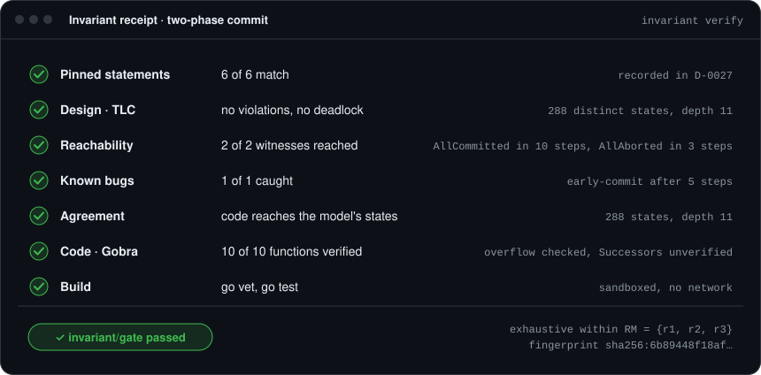

<p align="center">
  <picture>
    <source media="(prefers-color-scheme: dark)" srcset="docs/brand/logo-animated-dark.svg">
    
  </picture>
</p>

<p align="center">
  <strong>A code factory that doesn't guess.</strong><br>
  You ratify what must be true. Invariant proves every pull request against it before merging.
</p>

<p align="center">
  
  
  
  
  
</p>

<br>

AI coding agents don't ask clarifying questions. They pick an interpretation and ship it with total confidence. Formal verification alone doesn't fix that. A proof only shows the code matches the property someone wrote down, and if the agent wrote that property, the proof just certifies the agent's guess.

Invariant splits the work where it belongs:

| People decide | Invariant proves |
| :-- | :-- |
| What must always be true: invariants, safety properties, and the bounds they're checked at | That the code satisfies them, using a model checker for the design and a verifier for the code |
| Every fork the factory can't resolve on its own | Only what it was asked to prove. Ratified statements are pinned, and the factory can't edit them |

<p align="center"><a href="#try-it"><strong>Try it</strong></a> in a minute · <a href="#use-it-on-your-repository"><strong>Use it on your repository</strong></a></p>

## How it works

<picture>
  <source media="(prefers-color-scheme: dark)" srcset="docs/assets/how-it-works-dark.svg">
  
</picture>

1. **Formalize.** Invariant drafts the properties an issue implies. Writing a formal spec forces every ambiguity into the open. You can't model a buffer, for example, without deciding what happens when it's full.
2. **Ask.** When Invariant hits a fork it can't resolve, it posts the question back on the issue as a decision request. It doesn't pick an answer for you.
3. **Ratify.** A person approves each statement. The approval is recorded along with where the statement came from, and the statement is pinned by hash.
4. **Synthesize.** Invariant writes the implementation, in Go, TypeScript or Python, and the TLA+ model. It keeps repairing them against counterexamples until the gate passes.
5. **Gate and merge.** CI re-runs every check on the committed artifacts. The pull request merges only if every check passes.

What an issue builds or changes is a **project**: one component, such as a rate limiter, with its ratified statements, its TLA+ model and its code, in a directory with an `.invariant/` folder. The gate checks each project on its own and writes a receipt for each.

## Watch it take an issue

<p align="center">
  
</p>

This is the factory's first real issue, as it happened on GitHub. [#1](https://github.com/gitdek/invariant/issues/1) asked for a bounded buffer for log shipping and left two decisions open: what happens when the buffer is full, and what happens when a send fails. Invariant didn't choose. It asked, drafted 13 statements with @gitdek's answers, and had TLC check them against a draft model before anyone was asked to ratify them. After @gitdek ratified, it wrote the code, proved it with Gobra, and opened [#2](https://github.com/gitdek/invariant/pull/2). It merged #2 itself once CI's gate passed on that exact commit.

People steer the factory with comments on the issue, and only people with write access are heard:

| On the issue | What happens |
| :-- | :-- |
| `/invariant solve`, or the `invariant` label | The factory takes the issue |
| `/invariant choose F1 A` | Decides a question the factory asked |
| `/invariant revise` | The factory drafts again, reading the comments |
| `/invariant ratify <hash>` | Ratifies exactly the proposal with that hash, and the factory builds it |
| The `invariant:go`, `invariant:typescript` or `invariant:python` label | The factory writes the code in that language. Without one, the repository's default applies: Go here |
| A `Project: <dir>` line in the issue | Changes that existing project. The factory proposes a diff of its statements, and calls out anything removed or loosened |
| An `Agent: codex` or `Agent: claude-code` line in the issue | Picks the coding agent that drafts the issue and builds it, as the line reads when the issue is drafted. A new project's manifest records it, so the project's later issues get it unless they pick another. Without either, the factory's own agent, `-agent`, does. The factory runs Claude Code and Codex, and answers an issue that picks an agent it can't run, or Codex where it isn't set up, instead of drafting it |
| `Code: <path>` lines in the issue | Checks existing TypeScript code as it is, without changing a line. The factory writes only the model and a driver that runs the real code |
| A `Kind: plumbing` line in the issue | For a change that isn't a state machine. The factory proposes a plan: what changes, the files it may touch, and acceptance tests. Once a writer ratifies it, the build must pass those tests unchanged, and a person merges anything in the trusted base. On this repository only, for now |
| `/invariant retry` | Looks again at a pull request that failed, once someone has fixed the cause |
| `/invariant plan` | On an issue that holds or links a PRD, the factory proposes a plan of at most 10 issues in place of statements. Once a writer ratifies it, the factory opens the plan's issues one at a time, each once the one before has merged, and takes each on that writer's authority |
| `/invariant stop` | On a ratified plan's issue, the factory opens no more of the plan's issues. One already open goes on as it is |

Anyone can open an issue, but the factory takes one only when a writer labels it, or says `/invariant solve` or `/invariant plan`. That hands the issue's text to a coding agent, so read someone else's issue before you do. The agent that drafts statements has no network and no GitHub access, and nothing it drafts is built until a person ratifies it.

## Watch it catch a bug

<p align="center">
  
</p>

Passing TLC only means something if the invariants could have failed. So the gate plants known bugs in the model and requires TLC to catch each one. This is the real counterexample for the two-phase commit example's planted bug: a coordinator that commits after hearing from one resource manager instead of all three. TLC finds the shortest path to an inconsistent commit. In five steps, r2 aborts on its own, the coordinator commits anyway on r1's vote alone, and r1 commits.

## One action, one contract

<p align="center">
  
</p>

The factory owns both the model and the code, and each Go method's contract restates exactly one TLA+ action. The code refuses a step the model can't take, by itself, so its contract says both outcomes. `ok` holds exactly when the action's enabling condition held. A step it takes has the action's effect, a refusal changes nothing, and nothing else ever changes. Sending the action's message is the caller's job, since messages belong to the environment. TLC checks the model, Gobra proves the code at every size, and the gate explores the code to confirm that both reach the same 288 states.

## The gate

| Check | Tool | Fails when |
| :-- | :-- | :-- |
| Pins | Invariant | A ratified statement's text, or anything it depends on, has changed |
| Design | TLA+ · TLC | An invariant is violated, or the system can deadlock, within the ratified bounds |
| Reachability | TLA+ · TLC | A ratified witness can't be reached, so the invariants might hold only because nothing happens |
| Known bugs | TLA+ · TLC | A ratified bug, added to the model as an extra action, slips past the invariants |
| Agreement | Invariant | Go: the code, explored from its initial state, doesn't reach exactly the states TLC found in the model |
| Conformance | Invariant · TLC | TypeScript and Python: the real code, driven through its operations, takes a step the model doesn't allow |
| Code | Gobra · Nagini | A function doesn't verify against its contract, or an index or integer operation could fail |
| Build | vet · tests | Anything is red. Runs in a sandbox with no network and no secrets. |
| Scope | Invariant | A factory pull request changes anything outside its one project, adds a dependency, uses cgo, or edits CI config or a ratified lock |
| Ratification | Invariant · GitHub | A factory project's lock isn't exactly the proposal a person with write access ratified on its issue |

Every pull request carries a receipt that CI generates from tool output. It lists the states explored and the bounds they cover, the functions verified, the statement hashes, and the tool versions. The factory never writes its own receipt.

## One model, three languages

The same ratified two-phase commit, pinned by the same hashes, checked in each of the languages Invariant targets:

| Implementation | How the code is checked | Evidence |
| :-- | :-- | :-- |
| [Go](examples/02-twophase-commit) | **Proved at every size.** Gobra verifies every function against a contract that restates a TLA+ action. | The code reaches exactly the model's 288 states, and its 1,568 one size larger |
| [Go, written by the factory](examples/02-twophase-commit-synthesized) | **Proved at every size**, in the same way | Written from the ratified statements alone. It passed on its first gate run |
| [TypeScript](examples/02-twophase-commit-ts) | **Tested against the model** in every state it can reach. Its driver tries every step in every state, and TLC checks each one. | All 288 of the model's states, 4,896 steps tried, refusals included, and none outside the model |
| [Python](examples/02-twophase-commit-py) | **Proved at every size.** The factory rebuilt it on [#51](https://github.com/gitdek/invariant/issues/51) around a core Nagini verifies, 8 of 8 functions | All 288 of the model's states, no step outside it |
| [Python, proved](examples/02-twophase-commit-py-proved) | **Proved.** Nagini verifies every step function against a contract that restates a TLA+ action. | Explored completely: all 288 of the model's states, no step outside it |

The receipt always says which kind of evidence it is. Plant the early-commit bug in the TypeScript or the Python and the gate rejects it at the exact step: the coordinator commits after a single vote.

A proof goes further than any run. Plant a `tm_commit` in the proved Python that goes wrong only if the coordinator had already aborted. No run can reach that state, so the tests and conformance pass. The contract doesn't rule it out, so Nagini rejects it.

The factory writes all three languages itself. The log buffer @gitdek ratified on [#1](https://github.com/gitdek/invariant/issues/1) was rebuilt from the statements alone, in each language, and every version passed on its first gate run:

| The factory's log buffer | How the code is checked | Evidence |
| :-- | :-- | :-- |
| [Go](examples/03-log-buffer), merged in [#2](https://github.com/gitdek/invariant/pull/2) | **Proved.** Gobra verifies 5 of 5 functions | The code reaches exactly the model's 87 states |
| [TypeScript](examples/03-log-buffer-ts) | **Tested against the model** in every state it can reach. The driver explores the state machine completely | All 87 of the model's states, no step outside it |
| [Python](examples/03-log-buffer-py) | **Proved.** Nagini verifies 5 of 5 functions | All 87 of the model's states, no step outside it |

Then the factory took its next issue as its own bot, `invariant-code-factory[bot]`. [#3](https://github.com/gitdek/invariant/issues/3) asked for a token-bucket rate limiter in TypeScript. The bot asked two questions, drafted 12 statements with the answers, committed the ratification, wrote [the code](examples/04-api-rate-limiter), opened [#4](https://github.com/gitdek/invariant/pull/4), and merged it once CI's gate passed: 26 minutes from issue to merge. The code is tested against the model in all 6,375 of its states. @gitdek made the two decisions and ratified; the bot did everything else.

## Watch it catch a real bug

Then Invariant went to work on code nobody wrote for it. copythis-ad is a Next.js app whose video-analysis workers claim jobs under leases, renew them, and complete their attempts. Leases can run out, stalled jobs get retried, and people cancel. An issue asked the factory to check that protocol as it is, without changing a line: `Code: src/lib`.

- **It asked instead of guessing.** A lease can run out before the recovery sweep records it, and the code, its comments and its tests didn't agree on what a person's retry should do in that window. @gitdek chose: a cancel wins, but a retry must never erase the record that the attempt may have been charged.
- **It proposed 19 statements**, checked by TLC in 1,682 states before anyone ratified them. Six were known bugs the rules must catch.
- **Its driver ran the real store,** in memory and on its own clock, in a sandbox built from the app's own lockfile, and TLC checked every step against the model. At first the driver skipped the one step the new rule was about. A review caught that before merge, and D-0059 now forbids it. Once the skip was gone, the gate caught the real code taking that step: a stalled retry canceled a possibly charged attempt and requeued the job, so nobody would ever review it.
- **The fix was one guard, in an ordinary pull request,** and then the bot merged the check. Now every pull request to copythis-ad runs the real lease code against the rules @gitdek ratified.

## Watch it build itself

Then Invariant turned on itself. The rules that decide what the factory does on an issue are what make it trustworthy. They cover who can direct it, what it may ratify, and when it may merge. Until slice 7, they were ordinary Go, checked only by tests.

- **It formalized its own rules.** [#9](https://github.com/gitdek/invariant/issues/9) described the factory's issue protocol in plain language, written from the watcher's code. The factory drafted a TLA+ model of one issue, checked in 8,334 states, with five known bugs the rules must catch. One of them is a merge of a commit that's no longer the pull request's head. The statements were ratified on the issue.
- **It proved them.** The factory wrote [`factory/protocol`](factory/protocol) in Go, Gobra proved every step against its contract, and the bot merged [#11](https://github.com/gitdek/invariant/pull/11) once CI proved it again.
- **The proof caught its own author.** Wiring the watcher to the proved core, [#12](https://github.com/gitdek/invariant/pull/12), means the watcher takes a step only if the model has it. Its own tests then showed three steps it had always taken that the ratified rules didn't have: a build that stops before it opens a pull request, a build that fails its own gate, and a pull request that passes CI but can't merge.
- **It changed its rules through itself.** [#13](https://github.com/gitdek/invariant/issues/13) asked the factory to add those steps. It asked two questions, including what a writer can do after a build stops, and @gitdek answered them. Then it proposed the amendment, checked by TLC in 24,762 states. @gitdek ratified it from the dashboard's new `/act` page, the first ratification made there. The factory changed its own proved core, and CI proved it again before the bot merged [#15](https://github.com/gitdek/invariant/pull/15).

## Stop it anywhere

<p align="center">
  
</p>

The watcher takes each step as a few effects on GitHub, and it can stop between any two: a crash, a restart, a laptop going to sleep. Two watchers can also run on one repository at once.

- **It modeled its own recovery.** [#23](https://github.com/gitdek/invariant/issues/23) asked the factory to prove that every effect happens exactly once, whatever stops it, and that every command is still answered. It drafted 23 statements, among them two "eventually" properties under ratified fairness, which the gate now checks.
- **It proved the core.** The factory wrote [`factory/recovery`](factory/recovery), Gobra proved it at every size, and the bot merged [#25](https://github.com/gitdek/invariant/pull/25). It took 31 minutes and $1.74 of agent spend.
- **The watcher runs on it.** It records each agent run and merge where every watcher can see them, and one watcher at a time holds a lease in a Git ref. It takes every effect only as the proved core allows ([#24](https://github.com/gitdek/invariant/pull/24), [#26](https://github.com/gitdek/invariant/pull/26)).

The test above stops the watcher before each of its effects and starts a fresh one. Every time, the issue still merges with every effect done once.

## Try it

With Go 1.27.1 or later and Docker installed, run:

```bash
git clone https://github.com/gitdek/invariant && cd invariant
go run ./cmd/invariant verify examples/02-twophase-commit
```

The first run pulls about 440 MB of pinned images, and Docker must run linux/amd64 images, as Rosetta does on Apple Silicon. It prints a receipt. This is the real one for the [two-phase commit example](examples/02-twophase-commit):

<p align="center">
  
</p>

<details>
<summary>The receipt as text</summary>

| Check | Result | Evidence |
| :-- | :-- | :-- |
| Pinned statements | ✅ 6 of 6 match | ratified by @gitdek on [#65](https://github.com/gitdek/invariant/issues/65#issuecomment-5875563672), amending D-0027 |
| Design · TLC | ✅ no violations, no deadlock | 288 distinct states (1,146 generated), depth 11 |
| Reachability | ✅ 2 of 2 witnesses reached | `AllCommitted` in 10 steps, `AllAborted` in 3 steps |
| Known bugs | ✅ 1 of 1 caught | early-commit: `TCConsistent` violated after 5 steps |
| Agreement | ✅ code reaches the model's states | 288 states, depth 11 |
| One size larger | ✅ code reaches the model's states | 1,568 states, depth 14, within `RM = {r1, r2, r3, r4}` |
| Code · Gobra | ✅ proved: 10 of 10 functions verified | 10 with contracts, overflow checked, not verified: Init, load, store, mv, Try, Abstract |
| Code · conformance | ✅ tested against the model: every reachable state, no step outside it | 4,896 steps recorded, 288 of 288 model states visited |
| Every step tried | ✅ in every state reached, but where only the environment's bounds rule a step out | 4,896 attempts in 288 states, refusals included |
| Build | ✅ go vet, go test | sandboxed, no network |

Checked within `RM = {r1, r2, r3}`, and again one size larger, within `RM = {r1, r2, r3, r4}`. Within each, TLC's search is exhaustive. Gobra proves the code against its contracts at every size, and the design's rules are claimed only within the sizes checked.

</details>

## Use it on your repository

The factory runs on your machine. It polls GitHub through `gh`, runs its agents with your own headless coding agent, on your account, and merges only what your CI's gate passes. You need:

- **Go 1.27.1 or later, and Docker** that can run linux/amd64 images, as for [Try it](#try-it).
- **`gh`,** logged in as someone with write access to the repository.
- **A headless coding agent,** logged in. The factory runs Claude Code today, and a Codex backend is planned.

1. **Build the CLI from a clean checkout,** so it knows which commit of Invariant it is. `go install` doesn't work yet, because the module has `replace` directives. Any directory on your `PATH` will do:

   ```bash
   git clone https://github.com/gitdek/invariant && cd invariant && go build -o ~/.local/bin/invariant ./cmd/invariant
   ```

2. **Add the gate to your repository,** and commit it yourself, since the factory can't change CI. The workflow builds Invariant at your CLI's commit and runs the gate on every pull request:

   ```bash
   cd path/to/your-repo && invariant init -repo OWNER/NAME
   git add .github/workflows/gate.yml && git commit -m "Add Invariant's gate" && git push
   ```

3. **Require the gate, and allow merge commits.** GitHub then refuses any merge the gate didn't pass, yours included. `app_id` 15368 is GitHub Actions, so only the workflow's own check counts. The factory merges with a merge commit:

   ```bash
   gh api -X PUT repos/OWNER/NAME/branches/main/protection --input - <<'EOF'
   {"required_status_checks":{"strict":false,"checks":[{"context":"invariant/gate","app_id":15368}]},"enforce_admins":true,"required_pull_request_reviews":{"required_approving_review_count":0},"restrictions":null}
   EOF
   gh api -X PATCH repos/OWNER/NAME -F allow_merge_commit=true
   ```

4. **Run the factory:**

   ```bash
   invariant watch -repo OWNER/NAME -projects invariant -language go -agent claude-code
   ```

   `-projects` is the directory new projects go in. `-language` is what the factory writes when an issue doesn't pick one: `go`, `typescript` or `python`. `-agent` is the coding agent that drafts and builds an issue when neither it nor its project picks one: `claude-code` or `codex`. The factory acts as you, through `gh`. To have it act as its own bot, [set up a GitHub App](docs/factory-app.md) and add `-app-id`. Each issue's agents may spend up to $3 of estimated cost drafting statements, and $5 a build, on your account (`-formalize-budget`, `-budget`). Before it takes an issue, the watcher checks that it can run its coding agent, and any a project's manifest names: that the agent's CLI runs and is signed in, such as Claude Code with `claude auth login`. If one can't run, it doesn't start, and says what to fix. For Codex, sign it in once to a home of its own, which its commands can't read:

   ```bash
   mkdir -p "$HOME/Library/Application Support/invariant/codex"
   CODEX_HOME="$HOME/Library/Application Support/invariant/codex" codex login
   ```

   Codex's commands then run under a permission profile of Codex's own: they see only the workspace, the system and Go's toolchain, reach no network, and can't read your home directory. The watcher checks that before it runs Codex, and runs one Codex run at a time.

5. **Open an issue** that describes a component and what must always be true of it, and label it `invariant` or comment `/invariant solve`. [#18](https://github.com/gitdek/invariant/issues/18) is a good model. The factory asks about anything it can't settle, proposes statements, and builds once a writer ratifies them.

`Kind: plumbing` issues work only on this repository for now ([#103](https://github.com/gitdek/invariant/issues/103)).

## Status

Pre-alpha. The gate works end to end in Go, TypeScript and Python. The factory turns an issue into a merged pull request, with the code written in any of the three and checked against statements a person ratified on the issue.

- [x] **Slice 1 · The gate.** TLC, Gobra, and receipts on a hand-built [two-phase commit](examples/02-twophase-commit).
- [x] **Slice 2 · Synthesis.** Headless Claude Code rebuilt the model and the code from the ratified statements and the request alone. It [passed on its first gate run](examples/02-twophase-commit-synthesized), in 12 turns and under two minutes.
- [x] **Slice 3a · TypeScript and Python conformance.** Existing code is tested against the model, and the receipt says so.
- [x] **Slice 3b · Nagini spike.** Nagini proves a [Python core](examples/02-twophase-commit-py-proved) of two-phase commit, 8 of 8 functions, and catches a bug no run can reach.
- [x] **Slice 4 · GitHub.** [Issue #1](https://github.com/gitdek/invariant/issues/1) became a decision request, then a ratification, then [pull request #2](https://github.com/gitdek/invariant/pull/2), which the factory merged itself once CI's gate passed. The result is [`examples/03-log-buffer`](examples/03-log-buffer).
- [x] **Slice 5 · TypeScript and Python.** The factory writes both from ratified statements alone. The log buffer passed the gate on its first run in [TypeScript](examples/03-log-buffer-ts), tested in all 87 states, and in [Python](examples/03-log-buffer-py), proved with Nagini. Then the factory's own bot took [#3](https://github.com/gitdek/invariant/issues/3), a TypeScript rate limiter, from issue to merge.
- [x] **Slice 6 · Changing existing projects.** Amendments work: [#5](https://github.com/gitdek/invariant/issues/5) changed the rate limiter to refuse calls once too many are waiting, and the bot merged [#6](https://github.com/gitdek/invariant/pull/6) once CI's gate passed. And the factory checks existing code in other repositories, as it is: in copythis-ad, it caught a real bug in a production lease protocol.
- [x] **Slice 7 · Invariant builds itself.** The factory formalized its own issue protocol on [#9](https://github.com/gitdek/invariant/issues/9), wrote it as [`factory/protocol`](factory/protocol), proved with Gobra, and then changed it through [#13](https://github.com/gitdek/invariant/issues/13). Since [#12](https://github.com/gitdek/invariant/pull/12), the watcher checks every step it takes against it.
- [x] **Slice 8 · Code you can ship.** The factory now writes code with no model bounds in it, and the gate proves it at every size: [#18](https://github.com/gitdek/invariant/issues/18) asked for a connection pool, and the bot merged [#20](https://github.com/gitdek/invariant/pull/20), proved by Gobra at every size and in agreement with TLC one size past the bounds. The log buffer was rebuilt the same way, and code that hardcodes a size fails the gate.
- [x] **Slice 9 · The factory survives crashes and concurrent work.** The gate checks liveness: properties such as "every command is eventually answered" hold under ratified fairness. [#23](https://github.com/gitdek/invariant/issues/23) asked the factory to model its own crash recovery, and the bot merged [#25](https://github.com/gitdek/invariant/pull/25), proved at every size, for $1.74 in 31 minutes. The watcher now holds a lease, records its runs, and takes every effect only as that core allows. Stopped before any of its effects, it finishes the issue with every effect done once. Two watchers then ran on this repository for a day. When the old lease ran out, both reached for it in the same second: GitHub took the first watcher's push and refused the second's, since the lease had already moved. The second then read the first's next 563 renewals and never acted. ([D-0069](decisions/D-0069-slice-9-plan.md))
- [x] **Slice 10 · Public.** The repository is public, and GitHub refuses any merge to `main` without a pull request and a passing gate, the owner's included. Every run from an outside contributor needs approval ([D-0075](decisions/D-0075-slice-10-plan.md)).
- [x] **Slice 11 · A driver can't skip a step.** The gate checks that the code driving a project's code through its model tried every step a person could take, in every state it reached, except where only a bound rules one out, and a second agent reviews every driver. The factory rebuilt all twelve projects here through twelve issues: six TypeScript and Python drivers on Invariant's harness ([#47](https://github.com/gitdek/invariant/issues/47) to [#52](https://github.com/gitdek/invariant/issues/52)) and six Go explorers that report every step they try ([#64](https://github.com/gitdek/invariant/issues/64) to [#69](https://github.com/gitdek/invariant/issues/69)). Every receipt shows every step tried: 3,626,031 attempts in all, refusals included, 3,020,964 of them for the factory's own protocol. Every Go project is now proved at every size. Along the way, the check caught the agent's own first driver skipping a write into a full buffer while building [#54](https://github.com/gitdek/invariant/pull/54). The review caught a driver on [#59](https://github.com/gitdek/invariant/pull/59) that kept the code's messages itself, and three problems in the driver of copythis-ad's next pull request that no check could see ([D-0082](decisions/D-0082-slice-11-plan.md)).
- [x] **Slice 12 · One decision graph for every project.** Every project's decisions move into one embedded store, SQLite used as a graph, with a journal in each repository and traversal tools agents call over MCP, so a decision can be traced to what rests on it and what implements it ([D-0096](decisions/D-0096-decision-graph.md)). This repository's decisions are in it, and copythis-ad's too since it started its own journal ([copythis-ad#41](https://github.com/gitdek/copythis-ad/pull/41)), so a question crosses projects: what in copythis-ad rests on one of Invariant's decisions. `invariant decisions` records and answers, coding agents ask it over MCP, CI checks it on every change, and the dashboard draws it ([#135](https://github.com/gitdek/invariant/pull/135)). Now [#177](https://github.com/gitdek/invariant/issues/177) proves the journal in four parts. Part 1 is in: decision IDs are proved unique, and `decide` runs on the proof ([#192](https://github.com/gitdek/invariant/issues/192)). So is part 4: the store's journal is proved only to grow, and every write and rebuild runs on the proof ([#195](https://github.com/gitdek/invariant/issues/195)).
- [ ] **Slice 13 · The factory takes every change, and a whole PRD.** Plumbing goes through the factory too, with a plan and tests where a model doesn't fit, and a PRD becomes a plan of issues a person ratifies, which the factory works one at a time ([D-0105](decisions/D-0105-factory-takes-every-change.md)). In progress: the factory built eleven of its own plumbing changes on 2026-09-29, and since [#134](https://github.com/gitdek/invariant/pull/134) it works on three issues at once. `/invariant plan` turns a PRD into a plan of issues to ratify ([#139](https://github.com/gitdek/invariant/pull/139)), and the factory now works each plan a writer ratifies, one issue at a time ([#144](https://github.com/gitdek/invariant/pull/144), [#148](https://github.com/gitdek/invariant/issues/148)). It planned [#153](https://github.com/gitdek/invariant/issues/153), the first real PRD, then opened and built its first issue itself. The dashboard's `/act` plans too: it opens a PRD with `/invariant plan`, or plans an open issue a writer opened that the factory hasn't taken ([#201](https://github.com/gitdek/invariant/issues/201)). Paused since 2026-09-29 (D-0131): coding agents build changes by hand until the factory is in a better place to run for real.
- [ ] **Slice 14 · Codex on chosen projects.** A project picks its coding agent, Codex or Claude Code, and the factory runs Codex under the same rules, limits, view and records as Claude Code ([#153](https://github.com/gitdek/invariant/issues/153)). In progress: an issue picks its agent with an `Agent:` line, else its project's manifest does, that agent drafts and builds it ([#173](https://github.com/gitdek/invariant/issues/173)), and every record of its work names it ([#179](https://github.com/gitdek/invariant/issues/179)). Built by hand while the factory is paused: the factory takes back only regular files from an agent's workspace, Codex has a backend that runs it headless under a permission profile of its own, where its commands see nothing outside the workspace, the watcher checks its agents at start, the live view shows a Codex run, and Codex gets the decision graph's tools. Its first run built the two-phase commit and passed the final gate with proof ([#189](https://github.com/gitdek/invariant/pull/189)). Next: the factory's first Codex issue, once it resumes.

The slice plan and slice 1's acceptance criteria are in [D-0013](decisions/D-0013-slice-plan.md). Slice 4's are in [D-0036](decisions/D-0036-slice-4-plan.md).

## How decisions get made here

This repository runs on its own rule: **a decision that isn't written down didn't happen.**

- [`decisions/`](decisions/) is the record of what was decided, when, and by whom: a journal with one file per decision, and [`log.md`](decisions/log.md), its table. Decisions that are hard to reverse also record the options considered, the reasoning, and what would reopen them. `invariant decisions` writes them, and answers what rests on each one.
- A coding agent asks the record through MCP tools, which `invariant mcp -decisions -write` serves for the checkout. [`.mcp.json`](.mcp.json) starts them for agents that read it. Codex reads [`.codex/config.toml`](.codex/config.toml) instead, once you trust the checkout, and starts the server where Codex starts, so start Codex at the checkout's root. To give Codex the tools wherever it starts, add this to `~/.codex/config.toml`, with your checkout's path:

  ```toml
  [mcp_servers.invariant-decisions]
  command = "go"
  args = ["run", "./cmd/invariant", "mcp", "-decisions", "-write"]
  cwd = "/path/to/invariant"
  startup_timeout_sec = 120
  ```
- [`SPEC.md`](SPEC.md) is the current state, rolled up from the record. If the spec says something the record doesn't support, the spec is wrong.

<br>

<p align="center">
  <sub>Built by <a href="https://github.com/gitdek">@gitdek</a> · <a href="https://puglisij.com">puglisij.com</a><br>
  Every graphic above is generated from real <code>invariant verify</code> and test output by <a href="docs/assets/generate.py"><code>docs/assets/generate.py</code></a>.</sub>
</p>
