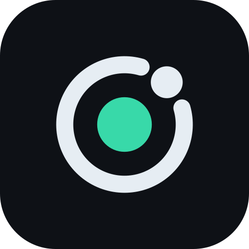

# Brand

**The mark** shows a single state traveling an orbit around a fixed point. The state passes through every reachable position, but the point at the center never moves. That point is the invariant, so it's the only part drawn in the accent color.

**The wordmark** is monoline and geometric, drawn with the same stroke as the orbit. The dots on the i's are in the accent color.

| File | Use |
| :-- | :-- |
| `logo.svg` / `logo-dark.svg` | Lockup for light and dark backgrounds |
| `mark.svg` / `mark-dark.svg` | The mark alone, drawn heavier for small sizes |
| `mark-tile.svg` | App-style tile for avatars, favicons and the portfolio card |
| `social-preview.png` | 1280×640 link preview for GitHub and the portfolio, rendered from `social-preview.html` |

| Color | On light | On dark |
| :-- | :-- | :-- |
| Ink | `#0E1116` | `#E6EDF3` |
| Accent | `#0CA678` | `#38D9A9` |

The accent marks the thing that holds, so don't use it for decoration.

The SVGs are generated by `generate.py`, which builds them from the geometry. To change one, edit the constants and run it again: `python3 docs/brand/generate.py`.

Status: proposed in D-0009.
